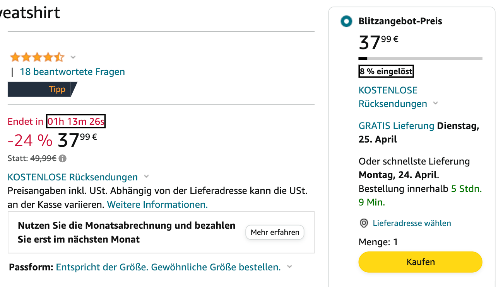
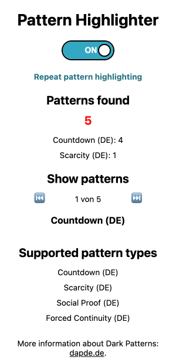

# Dapde Pattern Highlighter Browser Extension
This tool, developed by the informatics part of the [dapde-project](https://dapde.de/), is intended to help consumers to navigate the internet in a way similar to an ad blocker. However, the highlighter differs from ad blockers in one crucial aspect: it does not block individual dark patterns on websites but highlights them so that consumers become aware of the influences affecting them. In addition, the tool informs about the type of pattern.

## Contents
- [Features](#features)
- [Video and Screenshots](#video-and-screenshots)
- [How it works](#how-it-works)
- [Browser Compatibility](#browser-compatibility)
- [Installation](#installation)
- [Libraries Used](#libraries-used)
- [License](#license)
- [About Dapde](#about-dapde)

## Features
- Automatic detection of dark patterns on web pages
- Highlighting of suspicious elements with minimal impact on page appearance
- Popup window providing information on detected dark patterns, including their category and an explanation
- No blocking of web page content
- Extension icon displaying number of detected dark patterns
- Function to individually highlight each detected dark pattern
- Supporting multiple languages (currently English and German available)

## Video and Screenshots
### Teaser Video
Click on the image or [here](https://dapde.de/en/news-en/dapde-dark-pattern-highlighter-en/) to watch the teaser video for the Pattern Highlighter.

### Screenshots
|                                                                                                                                                                                  |                                                                                                                                                                            |
| :-------------------------------------------------------------------------------------------------------------------------------------------------------------------------------------------------------------------------: | :----------------------------------------------------------------------------------------------------------------------------------------------------------------------------------------------------------------------: |
| *Example of a web site with two highlighted dark patterns. The black border highlights a countdown and a scarcity pattern element (from left to right). \*Some web site details were manually removed from the screenshot.* | *The popup window of the extension. The popup window can be used to disable and enable the highlighting. Additionally, information about the detected patterns is displayed and each one can be highlighted separately.* |

## How it works
The Pattern Highlighter works entirely locally in the browser and does not connect to any servers. When visiting a web page, the extension injects a small script that creates an internal temporary copy of the entire web page i.e. its HTML DOM. After a short pause (about 1.5 seconds) a second copy is created. Subsequently, all elements of these copies are examined individually and in combination with child elements using the implemented pattern detection methods. The pattern detection methods decide whether an element is a specific dark pattern or not. The reason for creating two copies with a time gap is to detect changes on the web page. This makes it possible to detect certain patterns such as countdowns.

Mainly responsible for the results of the pattern detection are the mentioned detection functions. These are centrally defined in the `patternConfig` object together with information about the associated patterns in [`constants.js`](chrome/scripts/constants.js). This `patternConfig` object can be extended arbitrarily by additional patterns and functions, according to the requirements that are commented in [`constants.js`](chrome/scripts/constants.js).

Currently, one detection function each is implemented for the four following patterns.
- [Countdown](https://dapde.de/en/dark-patterns-en/types-and-examples-en/druck2-en/)
- [Scarcity](https://dapde.de/en/dark-patterns-en/types-and-examples-en/druck2-en/)
- [Social Proof](https://dapde.de/en/dark-patterns-en/types-and-examples-en/druck2-en/)
- [Forced Continuity](https://dapde.de/en/dark-patterns-en/types-and-examples-en/operativer-zwang2-en/)

Right now, all of the four detection functions are optimized for German and English websites and cannot be applied to websites in other languages.

## Browser Compatibility
| Browser         	| Is compatible? 	| Tested versions                                                               	|
|-----------------	|:--------------:	|-------------------------------------------------------------------------------	|
|  Google Chrome   	|        ✅       	| <ul><li>113.0.5672.92 (Mac/arm64)</li><li>113.0.5672.93 (Win/x64)</li></ul> 	|
|  Microsoft Edge  	|        ✅       	| <ul><li>113.0.1774.35 (Mac/arm64)</li><li>113.0.1774.35 (Win/x64)</li></ul>   	|

### Google Chrome, Microsoft Edge and Opera
The Pattern Highlighter uses an [API](https://developer.chrome.com/docs/extensions/reference/) that is specified by Google and primarily supported by the Google Chrome browser. However, many other browsers also support this Chrome API. Since Microsoft Edge and Opera, just like Google Chrome, are built on the [Chromium](https://en.wikipedia.org/wiki/Chromium_(web_browser)) code base, the [API support](https://developer.mozilla.org/en-US/docs/Mozilla/Add-ons/WebExtensions/Browser_support_for_JavaScript_APIs) of the three browsers is almost completely identical. Consequently, the extension will behave the same way in these browsers. This is also to be expected for other browsers that are based on Chromium.

## Installation
To install the extension, the repository or the `chrome` folder must be downloaded. Since the extension is not loaded from the stores of the browser providers, it must be installed in the developer mode of the browsers. For this, the individual steps for the different tested browsers are listed below.

### Chrome
1. Go to the Extensions page by entering `chrome://extensions` in a new tab.
   - Alternatively, click on the Extensions menu puzzle button and select **Manage Extensions** at the bottom of the menu.
   - Or, click the Chrome menu, hover over **More Tools**, then select **Extensions**.
2. Enable Developer Mode by clicking the toggle switch next to **Developer mode**.
3. Click the **Load unpacked** button and select the `chrome` directory.
4. (Optional): Click the Extensions menu puzzle button in the address bar and then click the **Pin** button next to the *Pattern Highlighter* to keep its icon permanently displayed.

## Libraries Used
- [Lit 2.7.2](https://lit.dev/) ([BSD-3-Clause](chrome/scripts/lit/LICENSE))

## License
[MIT](LICENSE)

## About Dapde
The Dark Pattern Detection Project (Dapde) examines the manipulation of consumers in a digital environment through "dark patterns".

### Dark Patterns
Dark patterns are design patterns that lead users to act in a certain way that is contrary to their interests, exploiting design power unilaterally in the interests of their creator.

### The Project
Dapde is a joint project between the Institute of Computer Science at Heidelberg University and the German Research Institute for Public Administration in Speyer (FÖV). The Informatics Section tackles the challenge of recognizing dark patterns in online interactions with the aim of warning users of dangers early on. The Law Section develops legal answers to the challenges of steering consumers through dark patterns.

### Dapde Website
More information about our project and dark patterns can be found on our [website](https://dapde.de/).